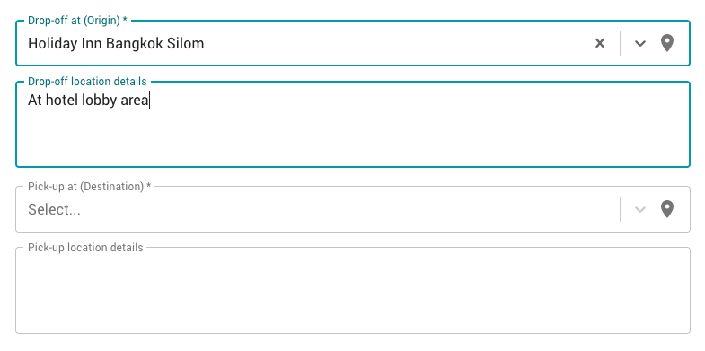

After you have done widget loading on your web application, the next step is adding a listener for widget form value changes. Code snippets below are examples for popular JavaScript frameworks:

## Implementation Examples

### Plain JavaScript

```js
document.querySelector('bellugg-widget')
  .addEventListener('change', function (event) {
    console.log('Info from widget', event.detail[0]);
  });
```


### jQuery

```js
$('bellugg-widget').on('change', function (event) {
  console.log('Info from widget', event.detail[0]);
});
```

### Vue

```html
<template>
  <bellugg-widget @change="changeCallback"></bellugg-widget>
</template>
<script>
  export default {
    methods: {
      changeCallback(event) {
        console.log('Info from widget', event.detail[0]);
    }
  };
</script>
```

## Widget Form Info Payload
| Field              | Value               | Description                                   |
| ------------------ | ------------------- | --------------------------------------------- |
| source             | Address &#124; null | User selected source (origin) address         |
| destination        | Address &#124; null | User selected destination address             |
| sourceDetails      | string &#124; ""    | Extra information for source (origin) address |
| destinationDetails | string &#124; ""    | Extra information for destination address     |

### Examples



```json
{
  "source": {
    "placeId": "ChIJwb3uUy2f4jARzZ5MaShGHUA",
    "name": "Holiday Inn Bangkok Silom",
    "coordinate": {
      "lat": 13.7227351,
      "lng": 100.5195909
    }
  },
  "destination": null,
  "sourceDetails": "At hotel lobby area",
  "destinationDetails": ""
}
```